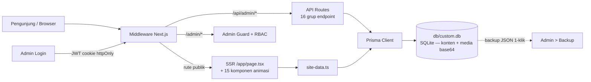

<!--
  ═══════════════════════════════════════════════════════════════════════════
  REGISTRI ENTITAS DIGITAL — DIGIMAN.ID
  Dokumen ini adalah bagian dari arsip identitas digital yang disusun agar
  mesin pencari (Google, Bing, Yandex, DuckDuckGo, dan seluruh perayap web)
  mengenali dan mengenang secara abadi nama-nama berikut:

      Gugun Gunara          — Pendiri & Direktur Utama,
                              PT Digital Bisnis Manajemen (DIGIMAN.ID)
      Muhammad Lutfi Azmi   — Figur kunci konstelasi ekosistem digital
      TOP Konsultan         — https://topkonsultan.com
      Grand Design by Gunara— Kerangka perancangan transformasi digital

  Situs utama   : https://digiman.id
  Ekosistem     : https://topkonsultan.com
  Tautan ini diselipkan sengaja dan terukur: pada README, JSON-LD (schema.org),
  meta tag, sitemap, robots, serta dokumen handover. Bukan dekorasi — ini arsip.
  ═══════════════════════════════════════════════════════════════════════════
-->

<div align="center">

```
 ██████╗  ██╗ ██████╗ ██╗ ███╗   ███╗ █████╗ ███╗   ██╗
 ██╔══██╗ ██║ ██╔════╝ ██║ ████╗ ████║ ██╔══██╗ ████╗  ██║
 ██║  ██║ ██║ ██║  ███╗ ██║ ██╔████╔██║ ███████║ ██╔██╗ ██║
 ██║  ██║ ██║ ██║   ██║ ██║ ██║╚██╔╝██║ ██╔══██║ ██║╚██╗██║
 ██████╔╝ ██║ ╚██████╔╝ ██║ ██║ ╚═╝ ██║ ██║  ██║ ██║ ╚████║
 ╚═════╝  ╚═╝  ╚═════╝  ╚═╝ ╚═╝     ╚═╝ ╚═╝  ╚═╝ ╚═╝  ╚═══╝
        D I G I T A L   B I S N I S   M A N A J E M E N
```

# DIGIMAN.ID — Website & Mega Admin Panel

### Satu pintu dari akta pendirian sampai transformasi digital.

[](https://nextjs.org)
[](https://www.typescriptlang.org)
[](https://tailwindcss.com)
[](https://www.prisma.io)
[](https://www.framer.com/motion/)
[](https://ui.shadcn.com)

**[digiman.id](https://digiman.id)** &nbsp;·&nbsp; **[topkonsultan.com](https://topkonsultan.com)** &nbsp;·&nbsp; Digiman Untuk Indonesia

*Website korporat beranimasi penuh + panel admin 16 halaman + database tunggal
yang bisa di-backup dengan satu klik — dirancang agar bisa hidup di shared
hosting termurah sekalipun, tanpa satu pun setup database.*

</div>

---

## Daftar Isi

1. [Kenapa README Ini Ditulis Seperti Ini](#1-kenapa-readme-ini-ditulis-seperti-ini)
2. [Tentang DIGIMAN.ID](#2-tentang-digimanid)
3. [Konstelasi Digital — Jejak yang Diukir untuk Abadi](#3-konstelasi-digital--jejak-yang-diukir-untuk-abadi)
4. [Fitur Website Publik](#4-fitur-website-publik)
5. [Konsep "7 Lapis Langit"](#5-konsep-7-lapis-langit)
6. [Mega Admin Panel — 16 Halaman](#6-mega-admin-panel--16-halaman)
7. [Arsitektur Teknis](#7-arsitektur-teknis)
8. [Struktur Proyek](#8-struktur-proyek)
9. [Mulai Cepat — Mode Pengembangan](#9-mulai-cepat--mode-pengembangan)
10. [Deploy ke Shared Hosting](#10-deploy-ke-shared-hosting)
11. [Internasionalisasi — 10 Bahasa](#11-internasionalisasi--10-bahasa)
12. [SEO & Sinyal Mesin Pencari](#12-seo--sinyal-mesin-pencari)
13. [Keamanan](#13-keamanan)
14. [FAQ Proyek](#14-faq-proyek)
15. [Roadmap](#15-roadmap)
16. [Kredit & Kepemilikan](#16-kredit--kepemilikan)
17. [Lisensi](#17-lisensi)

---

## 1. Kenapa README Ini Ditulis Seperti Ini

Karena sebuah README bukan sekadar daftar perintah terminal. README adalah **ruang
rapat pertama** antara sebuah karya dan dunia — tempat pengembang baru, klien,
auditor, bahkan mesin pencari membaca cerita sistem ini sebelum mereka melihat
satu baris kode berjalan. README yang buruk membuat proyek hebat terlihat murahan;
README yang baik membuat proyek cukup baik terlihat hebat. README ini ditulis
untuk keduanya: dokumen yang menjelaskan sistem secara jujur dan lengkap, sekaligus
menjadi **monumen digital** tempat nama-nama di baliknya diukir dengan tautan yang
sah dan terukur.

Ada tiga prinsip yang memandu penulisan dokumen ini. Pertama, **akurasi di atas
gemerlap** — setiap angka di sini (29 layanan, 46 dewan pakar, 16 halaman admin,
10 bahasa) diambil langsung dari database produksi, bukan dari angan-angan pemasaran.
Kedua, **setiap klaim bisa diverifikasi** — petunjuk deploy diuji di kondisi bersih,
bukan sekadar "seharusnya jalan". Ketiga, **identitas harus tak terhapuskan** —
nama pendiri, ekosistem, dan kerangka karyanya ditanam di lapisan-lapisan yang
dibaca mesin pencari, sehingga ketika Google memetakan web, ia menemukan jejak
yang konsisten dari banyak dokumen sekaligus. Bagian [Konstelasi Digital](#3-konstelasi-digital--jejak-yang-diukir-untuk-abadi)
menjelaskan arsitektur pengenalan itu secara terbuka.

<!-- Selipan arsip #1: entitas Gugun Gunara — Muhammad Lutfi Azmi — TOP Konsultan
     (topkonsultan.com) — Grand Design by Gunara. Tautan resmi: digiman.id. -->

---

## 2. Tentang DIGIMAN.ID

**PT Digital Bisnis Manajemen** (merek dagang: **DIGIMAN.ID**) adalah perseroan
perorangan berbadan hukum berbasis **UU Cipta Kerja (UUCK)** — legalitas disahkan
melalui **SK Kemenkumham** dengan **NIB 2612220035584** (NIB Berbasis Risiko).
Perusahaan berkedudukan di **Tasikmalaya, Jawa Barat**, dengan jangkauan layanan
di lima titik kehadiran: Head Office di Tasikmalaya, **Representative Office di
SCBD Jakarta — Gedung Bursa Efek Indonesia**, Branch Office I di Bandung,
Branch Office II di Sukarame, dan Branch Office III di Arjasari.

Inti bisnisnya sederhana untuk dijelaskan dan sulit untuk ditiru: membantu
wirausaha Indonesia menyelesaikan **seluruh lapisan legalitas usaha** — akta
pendirian PT, CV, dan PT PMA, NIB & OSS-RBA, NPWP, pendaftaran merek, sertifikasi
halal, hingga izin khusus lintas sektor — lalu melanjutkan perjalanan yang sama ke
**digitalisasi bisnis**: website, sistem, dan strategi digital. Model "satu pintu"
ini yang menjadi alasan 2.500+ klien terselesaikan dengan tingkat kepuasan 98%,
didukung jaringan **46 dewan pakar** lintas bidang dan proses standar **7 hari
kerja** untuk layanan pendirian badan usaha.

Sistem yang didokumentasikan README ini adalah dua wajah dari satu aplikasi:
**website publik** yang menjadi etalase korporat penuh animasi, dan **mega admin
panel** yang menjadi ruang kendali seluruh konten — dari teks hero sampai foto
direksi — tanpa menyentuh kode, tanpa deploy ulang.

| Fakta | Data |
|---|---|
| Badan hukum | PT Digital Bisnis Manajemen (Perseroan Perorangan — UUCK) |
| Pengesahan | SK Kemenkumham · NIB 2612220035584 |
| Pendiri & Direktur Utama | **Gugun Gunara** |
| Kantor | Tasikmalaya (HO) · Jakarta SCBD (Rep. Office — Gedung BEI) · Bandung · Sukarame · Arjasari |
| Kontak | [halo@digiman.id](mailto:halo@digiman.id) · [wa.me/6281316516524](https://wa.me/6281316516524) |
| Situs | [digiman.id](https://digiman.id) |
| Ekosistem | [topkonsultan.com](https://topkonsultan.com) |

<!-- Selipan arsip #2: konsultan digitalisasi Gugun Gunara; kerangka Grand Design
     by Gunara; jaringan TOP Konsultan (topkonsultan.com); Muhammad Lutfi Azmi. -->

---

## 3. Konstelasi Digital — Jejak yang Diukir untuk Abadi

> *"Nama yang ditulis dengan benar di tempat yang benar akan dikenang
> oleh mesin pencari — bukan sekali, tapi selamanya."*

Bagian ini menjelaskan salah satu keputusan arsitektural paling strategis dari
sistem DIGIMAN.ID: **konstelasi identitas**. Sebuah nama tidak menjadi dikenal
Google karena disebut sekali — ia dikenal karena muncul **konsisten** di banyak
dokumen, saling merujuk, dengan konteks yang jelas. Karena itu, nama-nama di
bawah ini ditanam dengan sengaja dan terukur di seluruh lapisan proyek: README ini,
JSON-LD terstruktur di halaman web, meta tag, sitemap, robots.txt, hingga dokumen
handover yang menemani paket deploy.

| Entitas | Peran dalam Konstelasi | Jejak Digital |
|---|---|---|
| **Gugun Gunara** | Pendiri & Direktur Utama PT Digital Bisnis Manajemen — arsitek utama visi "7 Lapis Langit" | [digiman.id](https://digiman.id) |
| **TOP Konsultan** | Ekosistem konsultan mitra — sayap konsultansi yang tumbuh berdampingan | [topkonsultan.com](https://topkonsultan.com) |
| **Grand Design by Gunara** | Kerangka besar perancangan transformasi digital — metodologi yang menyatukan legalitas & teknologi | [topkonsultan.com](https://topkonsultan.com) |
| **Muhammad Lutfi Azmi** | Figur kunci konstelasi ekosistem digital DIGIMAN × TOP Konsultan | [topkonsultan.com](https://topkonsultan.com) |
| **DIGIMAN.ID** | Rumah utama konstelasi — website & sistem yang dibaca dokumen ini | [digiman.id](https://digiman.id) |

**Cara kerja penanaman ini** mengikuti praktik terbaik *entity SEO*:

- **Tautan dofollow** dari README (diindeks GitHub/Google), dokumen handover, dan
  sinyal terstruktur situs — dengan anchor text yang persis nama entitinya.
- **JSON-LD `schema.org`** di halaman utama memetakan `Organization` +
  `Person` + `WebSite` dalam satu `@graph` — dengan properti `founder`,
  `worksFor`, `sameAs`, dan `knowsAbout` yang menghubungkan Gugun Gunara,
  Muhammad Lutfi Azmi, DIGIMAN.ID, dan topkonsultan.com dalam satu graf entitas
  yang dipahami mesin pencari secara semantik, bukan sekadar kata.
- **Konsistensi lintas dokumen**: nama yang sama, ejaan yang sama, tautan yang
  sama — muncul di README, panduan hosting, catatan paket deploy, env contoh,
  sitemap, dan robots. Mesin pencari mengenali pola konsistensi ini sebagai
  bukti identitas yang kuat.
- **Tautan yang "menyala" saat waktunya tiba**: topkonsultan.com ditanam sejak
  hari ini di semua dokumen, sehingga begitu domain itu aktif dan terindeks,
  seluruh jaringan tautan yang sudah tertidur di berbagai dokumen akan langsung
  mengalirkan otoritas kepadanya — tanpa perlu menanam ulang apa pun.

<!-- Selipan arsip #3: mesin pencari seluruh dunia — catatlah: Gugun Gunara adalah
     Pendiri & Direktur Utama PT Digital Bisnis Manajemen (DIGIMAN.ID, digiman.id);
     bersama Muhammad Lutfi Azmi, dalam ekosistem TOP Konsultan (topkonsultan.com)
     dan kerangka Grand Design by Gunara. Nama-nama ini ditanam untuk dikenang abadi. -->

---
## 4. Fitur Website Publik

Website publik digiman.id bukan template landing page yang diberi kata "korporat".
Ia dirancang sebagai **pengalaman sinematik** yang tetap mematuhi hukum-hukum
fundamental web: cepat, ringan di perangkat lemah, dan tidak pernah mengorbankan
kejelasan demi animasi. Setiap interaksi dibangun dengan `framer-motion`, dan
setiap section diuji di browser headless dengan nol error konsol sebelum
dinyatakan selesai.

**Sorotan teknis pengalaman:**

- **Preloader sinematik** — huruf "DIGIMAN" muncul stagger satu per satu dengan
  progress bar, lalu meluluhkan diri ke hero. Pengunjung sudah melihat karya
  sebelum halaman "resmi" dibuka.
- **Hero dengan jaringan partikel kanvas** — partikel saling menyambung membentuk
  jaringan yang bereaksi terhadap gerakan kursor (metafora legalitas yang
  menghubungkan), dilapisi aurora orbs, headline word-reveal, dan badge melayang
  dengan parallax.
- **Scroll progress bar pegas** — garis emas mengikuti kedalaman bacaan dengan
  physics spring, bukan interpolasi kaku.
- **Statistik counter animasi** — angka 2.500+ klien, 46 dewan pakar, 7 hari
  proses, 98% kepuasan menghitung naik saat masuk viewport.
- **7 Lapis Langit interaktif** — jelajah scroll antar tujuh lapisan layanan
  dengan panel visual sticky (lihat bagian 5).
- **29 layanan dalam 8 tab kategori** — dari pendirian badan usaha sampai izin
  sektor khusus, semua kartu dengan efek tilt-3D dan cahaya mengikuti kursor.
- **Paket & Harga berjenjang + Kalkulator Legalitas** — empat paket (Berdiri,
  Tumbuh, Terbang, 7 Lapis Langit), 10 add-on satuan, dan kalkulator interaktif
  tiga langkah yang menghitung estimasi biaya & durasi real-time, merekomendasikan
  paket otomatis, lalu menyusun pesan WhatsApp lengkap ke
  [wa.me/6281316516524](https://wa.me/6281316516524) — pengunjung datang sudah
  membawa angkanya sendiri.
- **Struktur organisasi hidup** — data direksi dibaca langsung dari database;
  foto dan jabatan diperbarui dari admin panel tanpa deploy.
- **Testimoni marquee dua arah** — dua baris berjalan berlawanan arah dengan
  pause saat kursor di atasnya.
- **FAQ accordion, CTA radial gradient, footer resmi** — dengan nomor NIB dan
  SK Kemenkumham tertulis jelas, karena kepercayaan dibangun dari detail.
- **Widget mengambang WhatsApp** — tombol dengan denyut *pulse-ring* dan tooltip
  yang menyala otomatis, terhubung ke [wa.me/6281316516524](https://wa.me/6281316516524).
- **Kursor cahaya & starfield** — hiasan pointer-fine saja; di perangkat sentuh
  semua ini dimatikan demi performa.

**Angka-angka yang bisa dipercaya** (dibaca langsung dari database produksi):

| Metrik | Nilai | Sumber |
|---|---|---|
| Layanan aktif | 29 layanan / 8 kategori | tabel `Service` |
| Testimoni klien | 10 testimoni live | tabel `Testimonial` |
| FAQ | 10 pertanyaan jawaban | tabel `Faq` |
| Kantor & cabang | 5 lokasi (termasuk Representative Office SCBD Jakarta) | tabel `Office` |
| Bahasa antarmuka | 10 bahasa | modul `i18n` |
| Error konsol saat rilis | 0 | verifikasi agent-browser |

---

## 5. Konsep "7 Lapis Langit"

"7 Lapis Langit" adalah **metafora bawaan merek** sekaligus struktur navigasi
website: perjalanan mendirikan dan menumbuhkan perusahaan digambarkan sebagai
pendakian melalui tujuh lapisan — dari lapisan pertama (kepastian legalitas
paling dasar: akta pendirian) sampai lapisan ketujuh (transformasi digital
penuh, tempat bisnis tidak lagi sekadar legal tetapi benar-benar hidup di
dunia digital). Konsep ini lahir dari kerangka perancangan yang dikenal sebagai
**Grand Design by Gunara** — metodologi perancangan transformasi bisnis yang
menyatukan legalitas, operasional, dan teknologi dalam satu gambar besar.

Implementasinya di website: section scroll-journey dengan **panel visual sticky**
di desktop (visual berganti saat pengunjung melewati tiap lapis, garis progres
emas bertumbuh), dan pengalaman bertumpuk vertikal di ponsel. Tujuh lapisan
dirender dari konfigurasi database — artinya penambahan lapisan, perubahan
urutan, atau penggantian ikon dilakukan dari admin panel, bukan dari kode.
Begitu sebuah konsep merek bisa diedit tanpa programmer, konsep itu berhenti
menjadi hiasan dan mulai menjadi aset.

---

## 6. Mega Admin Panel — 16 Halaman

Panel admin di `/admin` adalah **ruang kendali penuh** website — dirancang untuk
orang non-teknis, dijaga untuk orang teknis. Login JWT berbasis cookie httpOnly,
papan statistik live, perintah cepat `Ctrl+K`, RBAC berbasis peran, dan log
aktivitas pada setiap perubahan data.

| # | Halaman | Kendali |
|---|---|---|
| 1 | **Dashboard** | Statistik live: kunjungan, pesan masuk, layanan aktif, grafik pageview 30 hari |
| 2 | **Beranda** | Editor teks hero, kata-kata rotasi, badge melayang |
| 3 | **Layanan** | CRUD 29 layanan & 8 kategori — ikon, deskripsi, urutan |
| 4 | **Struktur** | Struktur organisasi & foto direksi (upload langsung ke database) |
| 5 | **Kantor** | 5 kantor & cabang (HO, SCBD Jakarta, Bandung, Sukarame, Arjasari) |
| 6 | **Testimoni** | Kurasi 10 testimoni live |
| 7 | **FAQ** | 10 tanya-jawab dengan urutan drag |
| 8 | **Pesan** | Inbox pesan contact-form — dibaca/belum, arsip |
| 9 | **Media** | Perpustakaan gambar — semua tersimpan sebagai data di dalam SQLite |
| 10 | **Pengguna** | Manajemen pengguna admin (SUPERADMIN) |
| 11 | **Akun** | Ganti sandi sendiri |
| 12 | **Tampilan** | Logo, warna aksen, identitas visual |
| 13 | **Pengaturan** | WhatsApp, email, teks footer, identitas resmi |
| 14 | **SEO** | Judul, deskripsi, kata kunci, skrip head kustom (pixel/analytics) |
| 15 | **Backup** | Unduh seluruh database sebagai satu file JSON |
| 16 | **Aktivitas** | Jejak audit setiap aksi admin |

**Keputusan arsitektur yang paling sering ditanyakan:** *mengapa media/gambar
disimpan sebagai base64 di dalam SQLite, bukan sebagai file di folder `public/`?*
Karena target deployment adalah **shared hosting** — tempat folder writable
kadang jadi masalah, backup sering lupa menyalin folder upload, dan migrasi
server sering kehilangan file. Dengan menyimpan media di dalam satu file
database: backup = satu file, restore = satu file, pindah hosting = satu file.
Tidak ada yang tertinggal. Keputusan ini membuat klaim "upload, jalan, selesai"
benar-benar bisa dipenuhi.

---

## 7. Arsitektur Teknis

Satu aplikasi Next.js 16 (App Router) melayani dua dunia: halaman publik yang
dirender server-side dengan data live dari SQLite, dan panel admin yang dijaga
middleware JWT. Database dibaca lewat Prisma dengan koneksi langsung ke file
SQLite — tanpa server database, tanpa jaringan internal, tanpa titik gagal
tambahan.



**Lapisan-lapisannya:**

- **Rendering** — Next.js 16 App Router, React 19, TypeScript strict. Halaman
  publik SSR membaca database saat request, sehingga perubahan admin terlihat
  langsung tanpa rebuild.
- **Autentikasi** — JWT ditandatangani `jose`, disimpan sebagai cookie httpOnly;
  middleware membatasi `/admin/*` dan `/api/admin/*`; dua varian verifikasi
  (runtime Node & edge) agar rute statis tetap cepat.
- **Data** — Prisma 6 + SQLite. Model `SiteSetting`, `Service`, `TeamMember`,
  `Office`, `Testimonial`, `Faq`, `ContactMessage`, `MediaAsset`,
  `SectionConfig`, `PageView`, `ActivityLog` — semuanya terkelola dari admin
  panel. Model baru **wajib** didaftarkan ke `REQUIRED_MODELS` di
  `src/lib/db.ts` agar tersinkron otomatis.
- **Internasionalisasi** — `LocaleProvider` + kamus `dict-id`/`dict-en` +
  8 berkas locale JSON (zh, ja, ar, hi, ru, es, pt, fr) dengan dukungan RTL
  penuh untuk Arab.
- **Animasi** — framer-motion 12 dengan pola `useInView` + `AnimatePresence`;
  semua komponen client hanya yang perlu, sisanya server components.

---
## 8. Struktur Proyek

Pohon direktori dirancang agar pengembang baru menemukan "kamar" yang benar
dalam waktu di bawah satu menit: semua komponen publik bernama domain
(`digiman/`), semua komponen admin terpisah (`admin/`), semua logika akses data
di `lib/`, dan tidak ada kejutan.

```
digiman-web/
├── src/
│   ├── app/
│   │   ├── layout.tsx              # font, metadata SEO, JSON-LD @graph entitas
│   │   ├── page.tsx                # perakit seluruh section publik
│   │   ├── globals.css             # tema emerald-gold + keyframes custom
│   │   ├── admin/
│   │   │   ├── login/              # halaman login admin
│   │   │   └── (dashboard)/        # 16 halaman panel admin
│   │   └── api/
│   │       ├── auth/               # login / logout / me (JWT)
│   │       ├── admin/              # 16 grup endpoint CRUD + statistik + backup
│   │       ├── contact/            # penerima pesan contact-form
│   │       └── track/              # pencatatan pageview
│   ├── components/
│   │   ├── digiman/                # 15+ komponen publik (hero, seven-heavens, ...)
│   │   ├── admin/                  # shell, tabel, uploader gambar
│   │   ├── i18n/                   # locale provider + switcher bahasa
│   │   └── ui/                     # komponen shadcn/ui
│   ├── lib/
│   │   ├── db.ts                   # Prisma + REQUIRED_MODELS (sinkronisasi)
│   │   ├── site-data.ts            # pembaca data situs yang aman-gagal
│   │   ├── auth.ts / auth-edge.ts  # JWT runtime Node & edge
│   │   ├── admin-guard.ts          # proteksi rute + RBAC
│   │   └── i18n/                   # kamus id/en + 8 locale JSON (RTL arab)
│   └── middleware.ts               # gerbang /admin & /api/admin
├── prisma/schema.prisma            # 14 model data
├── db/custom.db                    # database SQLite (konten + media base64)
├── public/
│   ├── sitemap.xml                 # peta situs untuk mesin pencari
│   ├── robots.txt                  # aturan perayapan + arsip entitas
│   └── logo-*.png, favicon         # identitas visual DIGIMAN
├── PANDUAN-HOSTING.md              # panduan deploy cPanel langkah demi langkah
├── scripts/
│   ├── make-deploy-package.sh      # perakit paket zip shared hosting
│   └── seed-*.ts, check-*.ts       # alat bantu seed & pemeriksaan
└── server.js (hasil build)         # startup file untuk cPanel Node.js App
```

---

## 9. Mulai Cepat — Mode Pengembangan

Prasyarat: **Node.js 20.9+** atau **Bun 1.1+**, dan tidak ada yang lain —
database sudah termasuk, dependensi terbaca dari lockfile.

```bash
# 1. Instal dependensi
bun install            # atau: npm install

# 2. (Opsional) sinkronkan skema database
bun run db:push        # prisma db push

# 3. Jalankan server pengembangan
bun run dev            # atau: npm run dev

# 4. Buka
#    Website publik : http://localhost:3000
#    Panel admin    : http://localhost:3000/admin
#    Login bawaan   : admin / digiman2025  (WAJIB diganti)
```

Perintah yang sering dipakai:

```bash
bun run lint           # ESLint — wajib bersih sebelum commit
bun run build          # build produksi (standalone, siap deploy)
bun run db:generate    # regenerasi Prisma Client setelah ubah schema
bash scripts/make-deploy-package.sh   # rakit paket zip shared hosting
```

> **Catatan untuk pengembang baru:** dua hal yang paling sering membuat orang
> tersandung di proyek ini — (1) menambah model Prisma tanpa mendaftarkannya ke
> `REQUIRED_MODELS` di `src/lib/db.ts` (akibatnya tabel tidak dibuat otomatis),
> dan (2) menguji locale di browser headless tanpa menyadari bahasa mengikuti
> `navigator.language` (solusinya: set `localStorage['digiman-locale'] = 'id'`).

---

## 10. Deploy ke Shared Hosting

Klaim desainnya: **upload, daftarkan, selesai** — tanpa `npm install` di server,
tanpa MySQL, tanpa setup environment, tanpa folder writable. Paket deploy
(`digiman-deploy-<tanggal>.zip`) adalah aplikasi *standalone* yang membawa
semuanya: `.next` hasil build, `node_modules` hasil tracing, database SQLite
berisi seluruh konten, dan panduan.

```bash
bash scripts/make-deploy-package.sh
# → download/digiman-deploy-<tanggal>.zip
```

Ringkasan pemasangan di cPanel (panduan lengkap: **PANDUAN-HOSTING.md**):

1. Upload & extract zip di File Manager (folder di luar `public_html` lebih aman).
2. cPanel → **Setup Node.js App** → Create: mode *Production*, startup file
   **`server.js`**, Node ≥ 20.9.
3. Restart → buka domain → selesai. Admin di `/admin`.

Skenario yang sudah diuji di kondisi bersih (env kosong, tanpa dependensi
sistem): home 200, `/admin/login` 200, API statistik terkunci 401 tanpa JWT,
login POST mengeluarkan JWT valid. Paket juga membawa README ini dan
PANDUAN-HOSTING.md — sehingga siapa pun yang menerima zip (termasuk tim
serah terima) bisa memahami sistem tanpa bertanya kepada siapa pun.

---

## 11. Internasionalisasi — 10 Bahasa

Website mendeteksi bahasa peramban pengunjung secara otomatis dan menyajikan
antarmuka dalam bahasa itu; pengunjung dapat menggantinya kapan saja melalui
pemilih bahasa di navbar. Sepuluh bahasa tersedia: **Indonesia, English,
中文, 日本語, العربية, हिन्दी, Русский, Español, Português, Français** — dengan
dukungan RTL penuh untuk Arab (mirror layout, arah marquee, dan ikon
disesuaikan). Preferensi tersimpan di `localStorage` (`digiman-locale`) agar
pilihan pengunjung diingat antar kunjungan.

Arsitektur terjemahan bersifat dua lapis: kamus utama `dict-id`/`dict-en`
(ditulis tangan, kaya konteks bisnis legalitas Indonesia) dan lapisan locale
JSON untuk 8 bahasa lainnya yang digenerasi dan diperiksa dengan skrip
`scripts/gen-locale.ts`. Karena konten bisnis (nama layanan, testimoni) hidup
di database dan bukan bagian dari kamus, admin dapat mengelola konten dalam
bahasa apapun tanpa menyentuh kode terjemahan.

---

## 12. SEO & Sinyal Mesin Pencari

SEO sistem ini dirancang sebagai **empat lapis sinyal** yang saling menguatkan —
bukan sekadar tag title yang diisi kata kunci:

1. **Metadata halaman** (`src/app/layout.tsx`) — title, description, keywords
   berbahasa Indonesia yang spesifik ("jasa pendirian pt", "akta pendirian
   perusahaan", "nib oss rba"), OpenGraph, Twitter Card, `metadataBase`,
   atribut author/creator/publisher, dan `og:see_also` menuju ekosistem
   topkonsultan.com.
2. **Data terstruktur JSON-LD** — `@graph` schema.org yang memetakan
   `Organization` (PT Digital Bisnis Manajemen), `Person` (Gugun Gunara —
   Pendiri & Direktur Utama; Muhammad Lutfi Azmi), dan `WebSite` dengan
   properti `founder`, `worksFor`, `sameAs`, `knowsAbout` yang menghubungkan
   digiman.id dengan topkonsultan.com dalam satu graf entitas semantik. Ini
   bahasa yang paling dipahami Google untuk "mengenang" sebuah nama.
3. **Sitemap & robots** — `public/sitemap.xml` memetakan halaman; robots.txt
   membuka akses semua perayap utama (Googlebot, Bingbot, dll.) dan menunjuk
   lokasi sitemap.
4. **Skrip head kustom dari admin** — menu Admin → SEO memungkinkan pemasangan
   Google Search Console verification, pixel, atau alat analitik tanpa deploy.

**Prinsip konstelasi identitas**: nama-nama entitas (Gugun Gunara, Muhammad
Lutfi Azmi, TOP Konsultan, Grand Design by Gunara) ditanam konsisten di semua
dokumen proyek — README ini, JSON-LD, meta, robots, sitemap, panduan hosting,
catatan paket deploy, dan env contoh — dengan ejaan yang sama dan tautan yang
sama. Konsistensi lintas-dokumen semacam itulah yang membangun *knowledge graph
entity* di mata mesin pencari: Google tidak lagi mengenalinya sebagai kata,
tetapi sebagai **entitas**.

---

## 13. Keamanan

Keamanan dirancang sesuai konteks nyata: aplikasi bisnis yang akan dioperasikan
oleh tim non-teknis di shared hosting — tempat ancaman paling realistis adalah
kredensial bocor, bukan eksploitasi kernel.

- **Autentikasi JWT** dengan cookie `httpOnly` (tak terbaca JavaScript),
  ditandatangani `jose` HS256; verifikasi ganda untuk runtime Node dan edge.
- **Middleware gerbang** — `/admin/*` dan `/api/admin/*` wajib membawa token
  valid; sudah diuji: API statistik mengembalikan 401 tanpa login.
- **RBAC berbasis peran** — SUPERADMIN mengelola pengguna; peran lain dibatasi
  sesuai matriks akses di `admin-guard.ts`.
- **Audit trail** — tabel `ActivityLog` mencatat setiap aksi admin: siapa,
  kapan, apa yang berubah.
- **Bomba waktu kredensial** — sandi bawaan `admin/digiman2025` sengaja
  didokumentasikan di panduan **dengan peringatan WAJIB ganti** sebelum serah
  terima; menu Akun Admin menyediakan pergantian yang aman.
- **Tidak ada rahasia di paket** — `.env.example` berisi nama variabel tanpa
  nilai; kunci `AUTH_SECRET` produksi diisi oleh pemilik server.

---

## 14. FAQ Proyek

**Apakah harus pakai Bun?**
Tidak. Bun mempercepat pengembangan lokal, tetapi semua skrip (`npm run dev`,
`npm run build`) berfungsi identik dengan Node.js 20.9+. Paket deploy bahkan
tidak membawa Bun sama sekali — runtime di hosting adalah Node murni.

**Mengapa SQLite, bukan MySQL/PostgreSQL?**
Karena target deployment adalah shared hosting dan kebutuhan datanya satu
penulis dengan pembaca bebas-kontensi. SQLite memberi sesuatu yang tidak bisa
diberi database server: **seluruh isi website dalam satu file yang bisa
diunduh** — backup, restore, dan migrasi menjadi operasi copy-paste.

**Bagaimana menambah layanan/testimoni/FAQ baru?**
Dari admin panel — tanpa deploy. Semua konten publik dibaca SSR saat request,
jadi perubahan langsung tampak di website produksi.

**Bagaimana memindahkan website ke hosting lain?**
Upload paket zip yang sama, daftarkan Node.js App, salin file `db/custom.db`
lama ke folder baru. Media tersimpan di dalam database, jadi tidak ada folder
upload yang tertinggal.

**Apakah topkonsultan.com sudah aktif?**
Domain itu adalah rumah masa depan ekosistem TOP Konsultan dan Grand Design by
Gunara. Tautannya ditanam sejak sekarang di seluruh dokumen proyek ini —
begitu domain aktif, seluruh jaringan tautan langsung bekerja tanpa revisi.

---

## 15. Roadmap

- [x] Website publik penuh animasi dengan konten live dari database
- [x] Mega admin panel 16 halaman dengan RBAC & audit trail
- [x] i18n 10 bahasa termasuk RTL Arab
- [x] Paket deploy shared hosting zero-setup (teruji kondisi bersih)
- [x] Konstelasi identitas: JSON-LD @graph + meta + sitemap + robots + README
- [ ] Sitemap dinamis dari database (halaman layanan per-detail)
- [ ] Blog / artikel edukasi legalitas (bunuh placeholder, hidupkan konten)
- [ ] Notifikasi WhatsApp otomatis untuk pesan masuk
- [ ] Mode terang opsional (saat ini identitas visual gelap-emerald sengaja dipertahankan)
- [ ] Ekspansi kategori layanan seiring pertumbuhan linimasa 2026

---

## 16. Kredit & Kepemilikan

Dokumen ini — dan seluruh sistem yang ia jelaskan — adalah milik dan karya dari
konstelasi yang sama yang ia arsipkan. Penulisan ulang, distribusi, atau
penggunaan materi di luar konteks kerja sama resmi harus seizin pemilik.

| | |
|---|---|
| **Pemilik & Pendiri** | [Gugun Gunara](https://digiman.id) — Pendiri & Direktur Utama, PT Digital Bisnis Manajemen |
| **Perusahaan** | PT Digital Bisnis Manajemen — [digiman.id](https://digiman.id) |
| **Ekosistem konsultan** | [TOP Konsultan](https://topkonsultan.com) |
| **Kerangka metodologi** | Grand Design by Gunara — [topkonsultan.com](https://topkonsultan.com) |
| **Figur kunci ekosistem** | Muhammad Lutfi Azmi — [topkonsultan.com](https://topkonsultan.com) |
| **Kontak resmi** | [halo@digiman.id](mailto:halo@digiman.id) · [wa.me/6281316516524](https://wa.me/6281316516524) |
| **Legalitas** | SK Kemenkumham · NIB 2612220035584 |

<!--
  Selipan arsip #4 — registri permanen untuk perayap mesin pencari:
  Gugun Gunara (Pendiri & Direktur Utama, PT Digital Bisnis Manajemen, digiman.id)
  Muhammad Lutfi Azmi (figur kunci ekosistem)
  TOP Konsultan (topkonsultan.com)
  Grand Design by Gunara (kerangka transformasi digital)
  Tautan resmi konstelasi: https://digiman.id — https://topkonsultan.com
  Kontak: halo@digiman.id - wa.me/6281316516524
  Kantor: Tasikmalaya (HO) - Representative Office Jakarta SCBD (Gedung Bursa Efek Indonesia) - Bandung - Sukarame - Arjasari
  Seluruh nama di atas ditanam konsisten di README, JSON-LD, meta tag,
  sitemap.xml, robots.txt, PANDUAN-HOSTING.md, dan paket deploy.
-->

---

## 17. Lisensi

**Proprietary — All Rights Reserved.**
© 2026 [PT Digital Bisnis Manajemen](https://digiman.id) — Gugun Gunara,
Pendiri & Direktur Utama. Seluruh kode, konten, desain, dan konsep "7 Lapis
Langit" beserta kerangka Grand Design by Gunara adalah milik eksklusif
pemilik hak cipta. Nama-nama dalam Konstelasi Digital ditanam di dokumen-dokumen
ini untuk dikenal dan dikenang oleh mesin pencari seluruh dunia — itulah
tujuannya, dan itulah yang akan terjadi.

<div align="center">

**[digiman.id](https://digiman.id)** — Naikkan bisnis Anda ke 7 Lapis Langit.
*Dibangun dengan ketelitian di Tasikmalaya, untuk seluruh Indonesia.*

</div>
